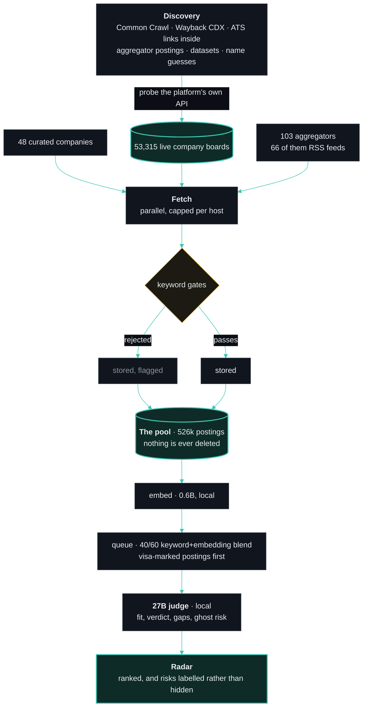
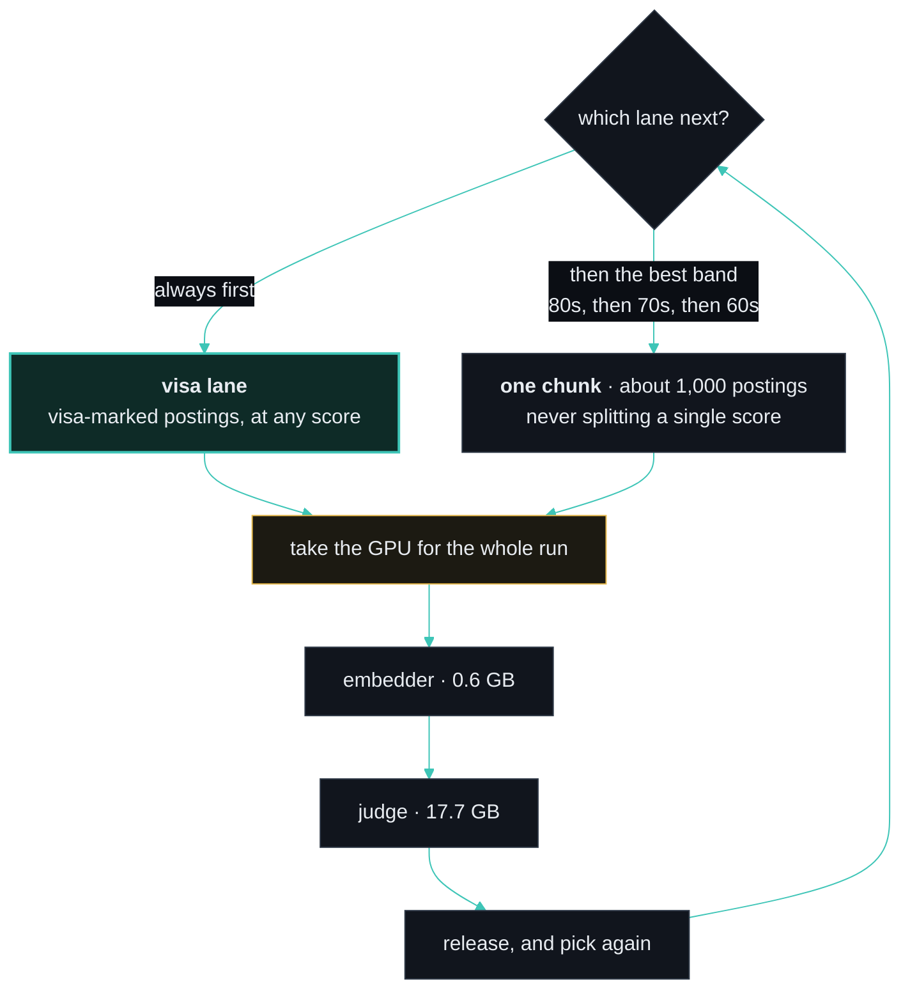

# JobRadar

[](https://github.com/OytunOnal/JobRadar/actions/workflows/ci.yml)
[](LICENSE)


A local-first job-discovery engine and application tracker. It finds the hiring
boards companies run themselves, reads them first-hand, scores every posting
against **your** CV with a model running on your own machine, and ranks what
survives on one page — so you stop tab-hopping across job boards, and so an SEO
repost, a ghost listing or a three-year-old evergreen ad arrives **labelled as
one** instead of costing you an evening.

It runs on your machine. Most sources need no key at all, and your CV never
leaves the disk.


**[Setup](docs/SETUP.md)** · **[Architecture](docs/ARCHITECTURE.md)** ·
**[Glossary](CONTEXT.md)** · **[Roadmap](docs/ROADMAP.md)**

> A personal tool and a portfolio project. Not affiliated with any job board.
> The engineering is the interesting part, so every claim below links to the
> decision record behind it.

## What makes it different

- **It reads the employer's own board, not a reseller's copy.** 53,315 live
  company boards, discovered and probe-validated automatically across 22 ATS
  platforms — plus 103 aggregator sources for reach.
- **Nothing is ever deleted.** A posting the keyword gates reject is stored and
  flagged, so fixing the scorer is a re-score rather than a re-crawl, and *"what
  did my filter wrongly kill"* is a query.
  ([ADR-1](docs/ARCHITECTURE.md#adr-1--store-everything-flag-judgment-store-all))
- **Risks are labelled, never hidden.** An old date or a ghost-sounding posting
  gets a badge under its score and stays in the list. A hidden posting teaches
  you nothing, and a filter that is wrong is invisible.
  ([ADR-9](docs/ARCHITECTURE.md#adr-9--disclose-the-risk-do-not-hide-the-posting) ·
  [ghost risk](CONTEXT.md#judgment))
- **Visa answers come from governments, not vibes.** The full public sponsor
  registers of the Netherlands, the UK, Denmark and Ireland — 146,746 companies —
  are matched by name, so a licensed employer ranks first and says so.
  ([visa tier](CONTEXT.md#visa))
- **Every ranking layer was measured, not guessed.** The embedding model and the
  40/60 keyword-embedding blend were chosen by a bake-off against frozen
  queries; the blend beats either signal alone.
  ([ADR-2](docs/ARCHITECTURE.md#adr-2--embedding-bake-off-with-pre-frozen-queries) ·
  [ADR-3](docs/ARCHITECTURE.md#adr-3--blend-ranks-not-scores--weight-chosen-by-sweep))
- **One strong local judge, not a cheap triage tier.** A cheap first pass
  measured 29% optimistic, so a single 27B model does the judging.
  ([ADR-4](docs/ARCHITECTURE.md#adr-4--one-strong-local-judge-over-a-cheap-triage-cascade))
- **It is not built around one person.** Tracks, seniority appetite, languages
  and regions all live in a profile generated from your CV — a junior data
  analyst and a staff game developer run the same code.
  ([ADR-6](docs/ARCHITECTURE.md#adr-6--persona-independence-detection-is-universal-judgment-is-profile))
- **Saying no is training data.** Dismissals are recorded with a reason, and
  those reasons are the most useful labels the system has.
  ([ADR-5](docs/ARCHITECTURE.md#adr-5--dismissal-reasons-as-labeled-training-data))

<details>
<summary><b>The 22 ATS platforms and the 103 other sources</b></summary>

**ATS platforms in the discovery registry** — Ashby, BambooHR, BeeSite, Breezy,
Comeet, Cornerstone, Eightfold, Greenhouse, Jibe/iCIMS, Jobvite, Join, Lever,
Oracle Cloud Recruiting, Personio, Pinpoint, Recruitee, Rippling,
SmartRecruiters, Softgarden, Teamtailor, Workable, Workday. Six more can be
fetched but are not yet discovered at scale (Avature, Gem, Getro, Phenom,
Radancy, SuccessFactors), for 28 in total. Every registry entry documents its
live-verified quirks: case-sensitive APIs, regional namespaces, POST-only
probes, redirect traps, locale-gated results.

Boards are found four ways — ATS links mined out of aggregator postings, bulk
Common Crawl and Wayback CDX sweeps, public company datasets, and guessing
tokens from company names — then **probe-validated live** against the
platform's own API before ingest trusts them.

**Aggregators and feeds** — national employment agencies (Germany, Sweden,
Denmark, Switzerland, Flanders, EURES), tech boards with structured visa flags
(GermanTechJobs, SwissDevJobs), country boards (Poland, Finland, Portugal,
Spain, France, Denmark), remote boards, HN "who is hiring", and a 66-feed
curated RSS layer behind one generic parser.

</details>

## How it works



Job descriptions are treated as untrusted input — prompt-injection guarded, and
verified against a live injection found in the pool. They are also **parsed into
sections** (requirements, responsibilities, benefits, boilerplate) so each
consumer gets the parts it needs within its own budget: the judge sees
requirements whole, the embedding sees what the job *is* rather than the
company's history
([ADR-7](docs/ARCHITECTURE.md#adr-7--a-posting-is-sections-not-a-prefix) ·
[view](CONTEXT.md#the-text-of-a-posting)).

A cloud multi-provider chain (Anthropic → Groq → Gemini …) sits behind the same
interface and replaces the local model with one environment variable.

## Quickstart

Node 20+, and [Ollama](https://ollama.com) if you want the judging to run
locally. Most sources need no key at all.

```bash
npm install
cp .env.example .env                          # optional: any LLM provider key
npm run cv:import -- "path/to/Resume.pdf"     # your CV aims the radar
npm run profile:generate                      # -> tracks, seniority, languages
npm run db:deploy                             # local SQLite
npm run ingest                                # fetch + score
npm run dev                                   # the radar at localhost:3000
```

That is a working radar. Everything else — filling the 53k-board company pool,
what each step does, the full command list, upgrading without losing your
database — is in **[docs/SETUP.md](docs/SETUP.md)**.

Once it is running, the **[profile page](http://localhost:3000/profile)** owns
the rest: your tracks and their keywords, seniority appetite, which model
judges, and what each change costs — it tells you how many postings a change
just made stale, and offers to repair them.

## The worker

`npm run ingest` fills the pool in minutes. Judging it takes far longer, because
a 27B model reads about one posting a minute — so the worker runs between
ingests and works the queue down.



A band never finishes before the next one starts on its best postings, so the
first hour returns the postings you would actually have read first rather than a
complete pass over a band you may never reach the end of. One model fits in a
consumer GPU at a time, so a file lock with a heartbeat hands the card to one
phase at a time instead of letting two processes swap 17.7 GB of weights every
few seconds. Kill it whenever — every lane resumes from what the database
already has.
([ADR-10](docs/ARCHITECTURE.md#adr-10--one-gpu-one-holder-chunked-bands) ·
[ADR-11](docs/ARCHITECTURE.md#adr-11--the-gpu-is-held-by-a-run-not-by-a-process) ·
[band, chunk, lane](CONTEXT.md#keeping-the-pool-judged))

## Tech

Next.js (App Router) · Prisma + SQLite · TypeScript · Ollama for the local
models, with a multi-provider cloud fallback · Common Crawl / Wayback CDX.

The schema is deliberately layered — a thin hot row, with text, vectors and
append-only history split off it. The main list query measures **4 ms** over
525k rows; before the split the same query paged through gigabytes. See
[the layered data model](docs/ARCHITECTURE.md#the-layered-data-model).

## Roadmap

- **Download it and run it** — the same engine as a free, open-source app
  rather than a clone and six npm scripts. A tray process owns the server and
  the workers; the browser tab is only a view. Every worker is already
  resumable, which is what makes this a supervisor rather than a rewrite.
- **Rescue lane** — mine the disqualified pool by embedding similarity, to catch
  gate mistakes automatically.
- Scheduled ingest and a digest; a manual LinkedIn trigger.

The decisions already made on each are in
**[docs/ROADMAP.md](docs/ROADMAP.md)**.

## License

MIT — see [LICENSE](./LICENSE).

## Credits

**Data used.** Every one of these is a starting point, not a source of truth —
each board is re-probed live against its own platform before ingest trusts it.

- [awesome-sustainability-jobs](https://github.com/pogopaule/awesome-sustainability-jobs)
  (CC BY-NC-SA 4.0) — company seed list, used as a non-commercial discovery seed.
- [open-jobs-data](https://github.com/ConorsCode/open-jobs-data) (MIT) —
  company-to-ATS map, used as discovery candidates.
- [awesome-job-boards](https://github.com/emredurukn/awesome-job-boards) (CC0) —
  the survey that turned up most of the keyless JSON-API boards and a good part
  of the RSS layer.

**Prior art I read.** What these gave me were API contracts, lessons and
mistakes already paid for. The specific debt is recorded at the line it applies
to, not only here.

- [career-ops](https://github.com/santifer/career-ops) — the largest debt by
  far. Its URL-key handling is why tracking params are stripped by denylist
  rather than allowlist, its liveness-core shaped the closure probing, and five
  connectors (The Hub, VDAB, Welcome to the Jungle, the Polish boards, the niche
  boards) were built against contracts it had already worked out.
- [job-hunter](https://github.com/girshovich/job-hunter) — the Common Crawl CDX
  approach to finding ATS boards, and a slug-rejection rule I deliberately
  diverged from (`tests/discovery.test.ts` says why).
- [ai-job-search](https://github.com/MadsLorentzen/ai-job-search) — organising
  search queries by function rather than by title.
- [job-ops](https://github.com/DaKheera47/job-ops) — go at the API first and
  treat scraping as the fallback, which is how the sponsor registers are read.
