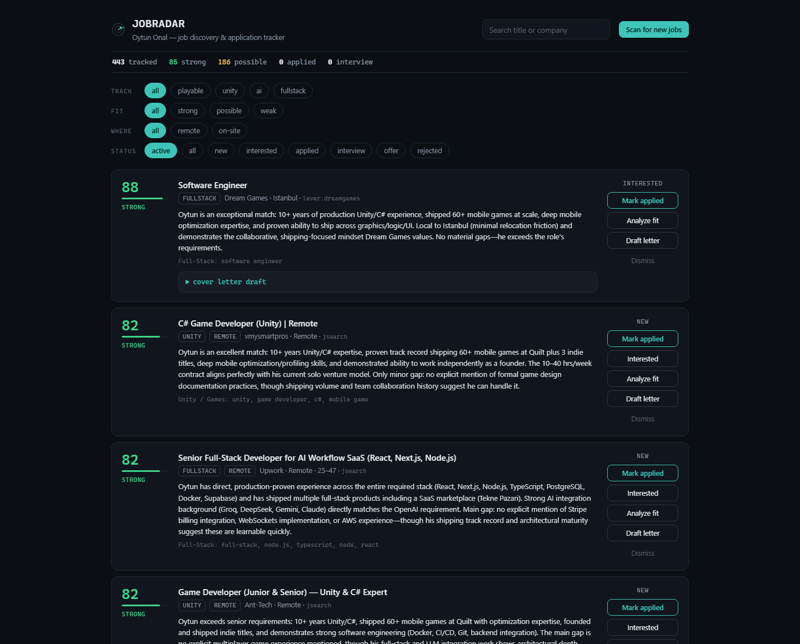

# JobRadar

[](https://github.com/OytunOnal/JobRadar/actions/workflows/ci.yml)

A local-first job-discovery engine and application tracker. JobRadar discovers
**~50,000 companies' official ATS boards**, pulls their listings first-hand
(**500k+ postings** in the current pool), scores each one against **your** CV
with a locally-run LLM, and ranks the fresh, real matches on a dashboard — so
you stop tab-hopping across job boards and stop wading through SEO reposts,
ghost postings, and years-old evergreen ads.

It runs on your machine, uses your own API keys where keys are needed at all
(most sources are keyless), and keeps your CV and personal data local — never
committed, never uploaded.



> Built as a personal tool + portfolio project. Not affiliated with any job board.
> The interesting part is the engineering: see [docs/ARCHITECTURE.md](docs/ARCHITECTURE.md)
> for the layered data model and the measured decisions behind the ranking stack.

## What it does

- **Discovers companies at scale.** A platform-agnostic discovery layer speaks
  **27 ATS platforms** — from startup staples (Greenhouse, Lever US+EU, Ashby,
  Workable, Recruitee, Personio) through enterprise systems (Workday,
  SuccessFactors, Oracle Cloud Recruiting, Eightfold, Cornerstone, Phenom,
  Radancy, Avature, BeeSite, Jibe/iCIMS…). Boards are found four ways —
  harvesting ATS identities out of aggregator job URLs, bulk Common
  Crawl/Wayback CDX sweeps, public company datasets, and name-guess probing —
  then **probe-validated live** against each platform's API. Every platform
  entry documents its live-verified quirks (case-sensitive APIs, regional
  namespaces, POST-only probes, redirect traps, locale-gated results).
- **Aggregates ~70 additional sources**: national employment agencies
  (Germany, Sweden, Denmark, Switzerland, Flanders, EURES), tech boards with
  structured visa flags (GermanTechJobs, SwissDevJobs), visa-focused feeds
  (Hunt UK Visa Sponsors), country boards (Poland, Finland, Malta, Ireland,
  Portugal, Spain, France), remote boards, HN who-is-hiring, and a
  65-feed curated RSS layer driven by one generic parser.
- **Stores everything, hides judgment.** Gate-rejected postings aren't dropped
  — they're stored with a `disqualified` flag. A scorer fix is a local
  re-score, never a re-crawl; "what did the filter wrongly kill" is a SQL
  query, not archaeology. Score and LLM-verdict history are **append-only and
  version-stamped**, so every ranking change is measurable after the fact.
- **Knows who sponsors visas.** The complete public sponsor registers of
  NL (IND), UK (Home Office), DK (SIRI) and IE (DETE) — ~146k companies — are
  loaded and name-matched, so sponsor-registered employers rank first and wear
  a badge backed by government data, not vibes.
- **Scores in layers, each measured:**
  1. a deterministic multilingual keyword scorer (title-first, gates + track
     scoring, per-track seniority bands, language-requirement detection);
  2. a local **embedding layer** (qwen3-embedding:0.6b, whole-CV query) whose
     model and blend weight were chosen by a frozen-query bake-off — the
     measured 40/60 keyword/embedding rank blend beats either signal alone;
  3. a locally-run **27B LLM** as the single fit judge (0-100 score,
     strong/possible/weak verdict, gap commentary, seniority classification,
     ghost-posting detection), fed visa-priority-first through the blended queue.
- **Fights junk on every layer**: SEO-farm domain denylist, source-trust
  ranking (own ATS > curated board > mass aggregator), dual-signal freshness
  (claimed date × "do we still see it listed"), closure-banner liveness probes
  in 10+ languages, semantic dedup of reposts, and LLM ghost-risk flagging.
- **Tracks your pipeline** on separate pages: a discovery-only radar with
  one-click dismiss-with-reason (the reasons feed back into scorer tuning), an
  applications page with follow-up nudges and ghosted detection, and a
  dismissed page that doubles as undo.

## How it works

```
                    DISCOVERY                                     INGEST
Common Crawl / Wayback ─▶ crawl ─┐                 curated companies ──┐
aggregator job URLs ────▶ harvest ├▶ AtsBoard ─▶ validate ─▶ 50k boards ├─▶ fetch (parallel,
public datasets ────────▶ seed ───┘ (candidates)  (probe APIs)          │    timeout-guarded)
company-name guesses ───▶ probe ──┘                    ~70 aggregators ─┘        │
                                                                                ▼
                                       keyword gates ─▶ store ALL (disqualified flagged)
                                                                                │
                          embedding (local) ──▶ 40/60 blended queue, visa tier first
                                                                                ▼
                                                     27B LLM fit judge (local Ollama)
                                                                                ▼
                                                        dashboard (fresh, ranked view)
```

Job descriptions are treated as untrusted input (prompt-injection guarded) and
trailing EEO/benefits boilerplate is trimmed before the model sees them. A
cloud multi-provider chain (Anthropic → Groq → Gemini …) exists behind the
same interface and can replace the local model with one env var.

## Setup

Requires Node.js 20+. For local LLM scoring: [Ollama](https://ollama.com) with
a model you can run (fit judging defaults to cloud keys if you set them instead).

```bash
npm install

# 1. Keys (optional — most sources are keyless). Any LLM provider key OR a
#    local Ollama model enables fit scoring + cover letters.
cp .env.example .env         # then edit

# 2. Your profile — name, location. Kept private (gitignored).
cp config/user.example.ts config/user.ts

# 3. Your CV — hand it your resume and the radar aims itself:
npm run cv:import -- "path/to/Resume.pdf"   # .pdf, .txt, or .md
npm run profile:generate   # CV -> tracks, seniority bands, languages, search queries

# 4. Database (local SQLite)
npm run db:deploy          # and again after every `git pull` — see below

# 5. (recommended) Fill the company pool from the web archives (~15 min):
npm run discovery:crawl
npm run discovery:validate -- 5000

# 6. Run
npm run ingest    # fetch + score into the DB (also discovers new boards)
npm run dev       # dashboard at http://localhost:3000
```

### Upgrading

```bash
git pull
npm install
npm run db:deploy   # apply any schema changes to your existing database
```

Your database is the part of this you cannot get back. It holds every
judgment the model has made — each one a minute of GPU that re-running
nothing will reproduce — plus your application history and dismissals. So
schema changes ship as **migrations**, which are ordered, recorded, and
applied without touching your rows.

If you have used this project before migrations existed, run
`npx prisma migrate resolve --applied 0_init` once to tell it your database
already has the current shape. Everything after that is `npm run db:deploy`.

## Commands

| Command | What it does |
|---|---|
| `npm run ingest` | Parallel fetch from every source, score, dedupe, store-all; harvests new ATS boards from aggregator URLs; writes the dashboard stats snapshot. |
| `npm run sweep` | Full board-pool sweep (all ~50k boards, sliced, RAM-aware, resumable). |
| `npm run discovery:crawl` / `discovery:validate` / `discovery:audit` | Bulk board discovery, live probe validation, extractor corpus audit. |
| `npm run cv:import` / `profile:generate` | Resume → CV context → generated scoring profile (reviewed JSON, never regenerates silently). |
| `npm run rescore` | Version-aware keyword re-score: only rows not yet scored by the current `SCORER_VERSION`. |
| `npm run fit:fill` | The LLM fit worker: blended-priority queue (visa tier first), self-resuming, quota-riding. |
| `npm run embed:fill` | Local embedding backfill for the blended queue. |
| `npm run desc:fill` | Description backfill for platforms whose list APIs carry no posting body. |
| `npm run sponsors` | Refresh the public visa-sponsor registers (NL/UK/DK/IE). |
| `npm run doctor` | Health-check every source connector. |
| `npm test` | ~235 unit tests grounded in real corpus data. |

## Configuring for your search

The pipeline is **persona-independent by design**: every personal preference —
tracks, seniority appetite (globally *and* per track), working languages, role
exclusions, regions — lives in your generated profile, not in code. A junior
data analyst and a staff game developer run the same code with different
profiles. See [docs/ARCHITECTURE.md](docs/ARCHITECTURE.md#persona-independence).

- **`config/user.ts`** — identity + optional overrides (tracks, regions).
- **`config/profile.generated.json`** — the CV-generated profile (gitignored);
  review and hand-edit freely, it never regenerates silently.
- **`src/lib/sources/companies.ts`** — hand-picked companies to always watch.
- **`src/lib/discovery/platforms.ts`** — the ATS registry; adding a platform
  is data, not code.

## Tech

Next.js (App Router) · Prisma + SQLite (layered schema: thin hot rows +
append-only history tables — main list query measured at 4 ms over 525k rows) ·
TypeScript · local LLM via Ollama (27B judge, 0.6B embeddings) with a
multi-provider cloud fallback · Common Crawl / Wayback CDX · ~235 unit tests.

## Roadmap

- Rescue lane: mine the disqualified pool by embedding similarity to catch
  gate mistakes automatically.
- Scheduled ingest + email digest.
- Manual LinkedIn trigger button (guest API, deliberately not automated).
- Optional Postgres/pgvector + deploy.

## License

MIT — see [LICENSE](./LICENSE).

## Data credits

- Company seed list from [awesome-sustainability-jobs](https://github.com/pogopaule/awesome-sustainability-jobs) (CC BY-NC-SA 4.0) — used as a non-commercial discovery seed; boards are re-verified live before ingest.
- Company/ATS map from [open-jobs-data](https://github.com/ConorsCode/open-jobs-data) (MIT), used as discovery candidates.
